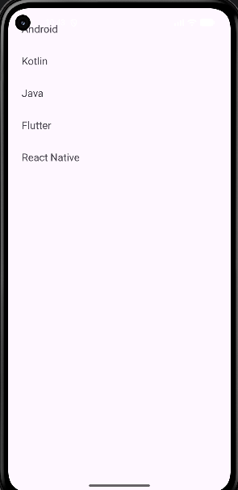
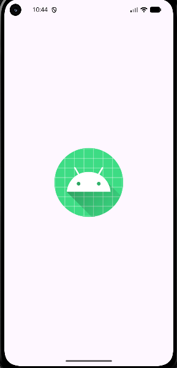
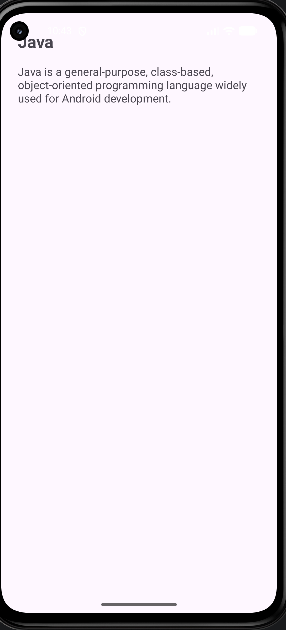

# Experiment 3 – Android Application Using Fragments for Flexible UI

 

## Student Details

 

**Name:** Lathika K 

**USN:** 25MCAR0103  

 

**Experiment:** 3  

**Topic:** Build an Android application using Fragments for flexible UI

 

## GitHub Repository

 

[Android-Fragments-Flexible-UI](https://github.com/Lathika-kathirvel/Android-Fragments-Flexible-UI)

 

---

 

## 1. Objective

 

To build an Android application using **Fragments** to demonstrate a flexible, modular, and reusable user interface.

 

The application demonstrates how different UI components can be separated into independent Fragments and displayed within an Activity.

 

---

 

## 2. Concept / Technology Used

 

### Android Fragments

 

A Fragment is a reusable portion of an Android application's user interface and behavior. Fragments can be combined within an Activity and can be replaced or updated dynamically.

 

Fragments are useful for:

 

- Creating modular user interfaces

- Reusing UI components

- Supporting flexible layouts

- Managing different sections of an application

- Providing better navigation between screens

 

### Technologies Used

 

- **Android Studio**

- **Kotlin**

- **Android SDK**

- **Fragments**

- **RecyclerView**

- **XML Layouts**

- **Gradle**

 

---

 

## 3. Scenario Used

 

This experiment demonstrates a **list-and-detail application scenario**.

 

The application displays a list of items using a Fragment. When the user selects an item, the corresponding details are displayed using another Fragment.

 

This demonstrates how Fragments can be used to create a flexible UI where different parts of the application can be managed independently.

 

### Application Flow

 

```text

Application Launch

       ↓

List Fragment

       ↓

User selects an item

       ↓

Detail Fragment

       ↓

Selected item information displayed

```

 

---

 

## 4. Project Folder and File Structure

 

```text

Android-Fragments-Flexible-UI/

│

├── app/

│   │

│   ├── src/

│   │   └── main/

│   │       │

│   │       ├── java/

│   │       │   └── application source files

│   │       │

│   │       ├── res/

│   │       │   ├── layout/

│   │       │   ├── drawable/

│   │       │   ├── mipmap/

│   │       │   └── values/

│   │       │

│   │       └── AndroidManifest.xml

│   │

│   └── build.gradle.kts

│

├── gradle/

│

├── Screenshot/

│   ├── output1.png

│   ├── output1.1.png

│   └── output2.png

│

├── build.gradle.kts

├── settings.gradle.kts

├── gradle.properties

├── gradlew

├── gradlew.bat

└── README.md

```

 

---

 

## 5. Application Output

 

### Output 1 – Initial Application Screen

 

The first screenshot shows the application after launching successfully.

 



 

### Output 1.1 – Fragment Interaction

 

This screenshot shows the application after interacting with the list/item and displaying the corresponding Fragment.

 



 

### Output 2 – Application Details

 

This screenshot shows the subsequent application output.

 



 

---

 

# 6. Test Cases

 

## Test Case 1 – Launch Application

 

### Test Objective

 

To verify that the Android application launches successfully.

 

### Test Steps

 

1. Open the application.

2. Wait for the application to load.

3. Observe the initial screen.

 

### Expected Result

 

The application should launch successfully without crashing and display the initial Fragment-based UI.

 

### Screenshot

 


 

### Status

 

**PASS**

 

---

 

## Test Case 2 – Select an Item

 

### Test Objective

 

To verify that selecting an item displays the appropriate Fragment.

 

### Test Steps

 

1. Launch the application.

2. View the list of available items.

3. Select an item.

4. Observe the displayed content.

 

### Expected Result

 

The corresponding detail Fragment should be displayed with the selected item's information.

 

### Screenshot

 


 

### Status

 

**PASS**

 

---

 

## Test Case 3 – Verify USN and Name

 

### Test Objective

 

To verify that the student's identification details are displayed correctly.

 

### Test Steps

 

1. Launch the application.

2. Navigate to the screen containing the student details.

3. Verify the displayed USN.

4. Verify the displayed name.

 

### Expected Result

 

The application should display the correct student **USN and Name**.

 

### Student Details

 

**USN:** YOUR_USN  

**Name:** Lathika Kathirvel

 

### Screenshot

 


 

### Status

 

**PASS**

 

---

 

# 7. Test Case Summary

 

| Test Case | Description | Expected Result | Status |

|---|---|---|---|

| TC01 | Launch Application | Application launches successfully | PASS |

| TC02 | Select an Item | Detail Fragment is displayed | PASS |

| TC03 | Verify USN and Name | Correct USN and Name are displayed | PASS |

 

---

 

# 8. How to Run the Application

 

1. Download or clone this repository.

 

```bash

git clone https://github.com/Lathika-kathirvel/Android-Fragments-Flexible-UI.git

```

 

2. Open the project in **Android Studio**.

 

3. Allow **Gradle Sync** to complete.

 

4. Make sure the required Android SDK is installed.

 

5. Connect an Android device or start an Android Emulator.

 

6. Select the device from Android Studio.

 

7. Click the **Run ▶** button.

 

8. The application will be installed and launched on the selected device.

 

---

 

# 9. GitHub Repository

 

The complete source code, screenshots, and documentation are available here:

 

[Android-Fragments-Flexible-UI](https://github.com/Lathika-kathirvel/Android-Fragments-Flexible-UI)

 

---

 

# 10. Conclusion

 

This experiment demonstrates the use of **Android Fragments** for developing a flexible and modular user interface.

 

The application separates different UI responsibilities into Fragment components and demonstrates how users can interact with different sections of the application.

 

Through this experiment, the concept of Fragments, Fragment-based navigation, reusable UI components, and flexible Android layouts is demonstrated successfully.

 

---

 

## Submitted By

 

**Name:** Lathika Kathirvel  

**USN:** 25MCAR0103
